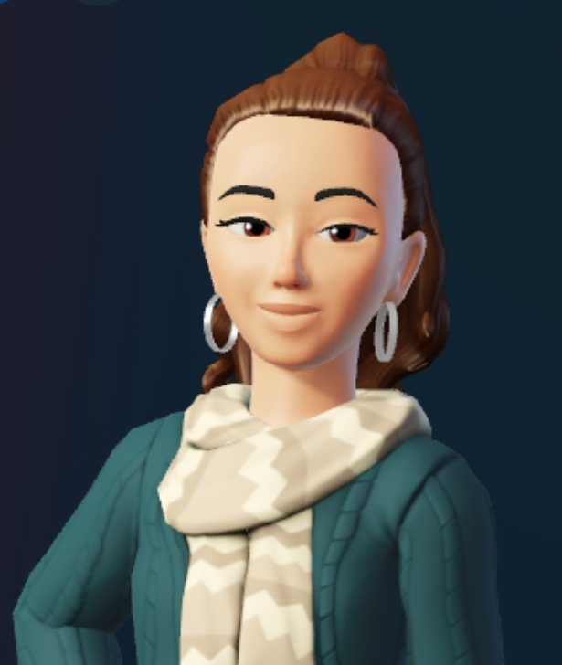

# avitalrosner.github.io

I'm currently a Master's student at [Weizmann](https://www.weizmann.ac.il/pages/), specifically in a rotation at [Shalev's lab](https://shalevlab.weizmann.ac.il/), where I helped establish a new method in the lab - the cell free RNA world :)

I love looking at cool phenomenas through different microscopes:
## Isn't it amazing?

In the above you can appreciate the cool “Brainbow” technology, it enable great advances in imaging by exploiting the Cre/lox system to randomly assign each cell a unique combination of red, yellow and blue fluorescent proteins.
(Copyright © Mo Costandi 2006-2021)

Outside of the scientific world, I enjoy spending time with my family and friends, and read load of books ;)

My GitHub: [Avital](https://github.com/Avitalrosner). 

Updates for the python course can be found in [python course](wis_python_course.md).

